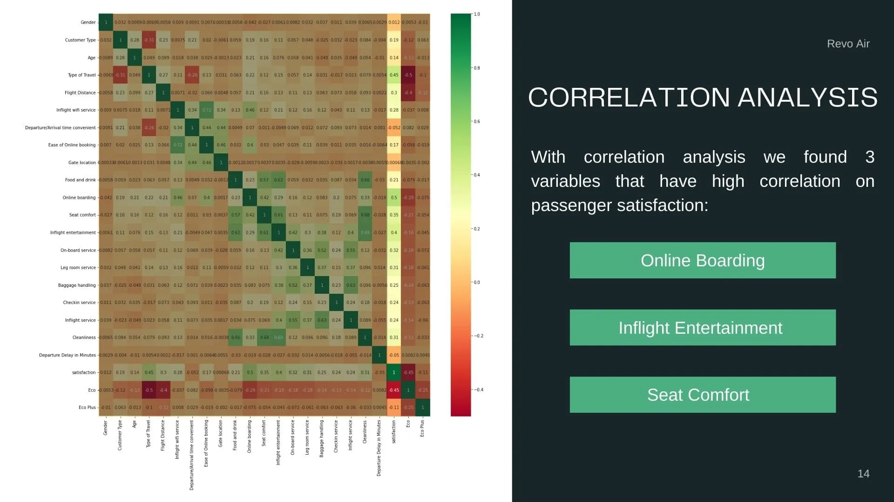

## Summary

Revo Air passenger satisfaction is declining, and in order to engage more customers, we must improve our service quality. So, we launched a survey to our passengers about their experience flying with us. After the analysis, we found 3 services as our main priority to improve on, namely: Online Boarding, Inflight Entertainment, and Seat Comfort.

## Current Situation

  
From the survey results, we find out that Revo Air only receives 43% satisfaction level which is pretty concerning for our business. So we have to improve the service to increase satisfaction level to 60% in 2023.  
  We managed to identify the characteristics of the dissatisfied passengers. They are within the age of 8-38 and 60+ group. They were in the Eco and Eco Plus Class. They were on a personal travel. Both our Member and Non-Member passengers. And that they were on a short-haul flight (Under 1000 Miles). The last part is the one that surprised us. Our initial hypothesis was that the longer the distance the more dissatisfied the passenger will be. The truth is passengers that traveled more than 1500 miles are satisfied with their flight, while passengers that traveled under 1000 miles (short-distance flight) are mostly dissatisfied.

  

## Result

We analyze the data using 3 methods: EDA, Correlation and Clustering Analysis

  
  
  

From the result shown above, we concluded 2 things:

- We need to focus on 3 services, namely: Online Boarding, Inflight Entertainment, and Seat Comfort.
- We need to focus on the 2nd cluster, which is where the majority of dissatisfied passengers are identified in.

As for our recommendation, you can read more details on our [**Canva Presentation**](https://www.canva.com/design/DAFBZzawX7Y/q30BuRiVnDIE-Xi0Iu4_cQ/view?utm_content=DAFBZzawX7Y&utm_campaign=designshare&utm_medium=link&utm_source=publishsharelink).
